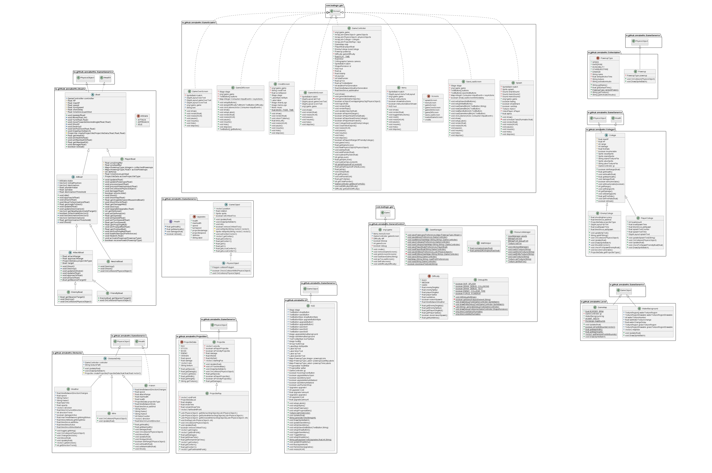

# Architecture
##This is the updated UML-Diagram for version 2.0.0 of our game. You can click on each Package to view them more clearly.
<!-- Image Map Generated by http://www.image-map.net/ -->

<map name="image-map">
    <area target="_top" alt="GameScreens Package" title="GameScreens Package" href="https://www.mario.shardsoftware.tk/img/gamescreens.png" coords="4026,27,1299,1408" shape="rect">
    <area target="_top" alt="GameGenerics Package" title="GameGenerics Package" href="https://www.mario.shardsoftware.tk/img/gamegenerics.png" coords="1145,1426,1864,2038" shape="rect">
    <area target="_top" alt="Boats Package" title="Boats Package" href="https://www.mario.shardsoftware.tk/img/boats.png" coords="349,499,1131,2222" shape="rect">
    <area target="_top" alt="Obstacles Package" title="Obstacles Package" href="https://www.mario.shardsoftware.tk/img/obstacles.png" coords="277,2424,1246,3314" shape="rect">
    <area target="_top" alt="Projectiles Package" title="Projectiles Package" href="https://www.mario.shardsoftware.tk/img/projectiles.png" coords="1268,2287,1833,3307" shape="rect">
    <area target="_top" alt="UI Package" title="UI Package" href="https://www.mario.shardsoftware.tk/img/ui.png" coords="2013,2012,2477,3307" shape="rect">
    <area target="_top" alt="GeneralControl Package" title="GeneralControl Package" href="https://www.mario.shardsoftware.tk/img/generalcontrol.png" coords="2621,1483,3938,2395" shape="rect">
    <area target="_top" alt="Collectables Package" title="Collectables Package" href="https://www.mario.shardsoftware.tk/img/Collectables.png" coords="4191,217,4835,753" shape="rect">
    <area target="_top" alt="Colleges Package" title="Colleges Package" href="https://www.mario.shardsoftware.tk/img/colleges.png" coords="4191,789,4872,1889" shape="rect">
    <area target="_top" alt="Level Package" title="Level Package" href="https://www.mario.shardsoftware.tk/img/level.png" coords="4148,2033,4937,2511" shape="rect">
</map>